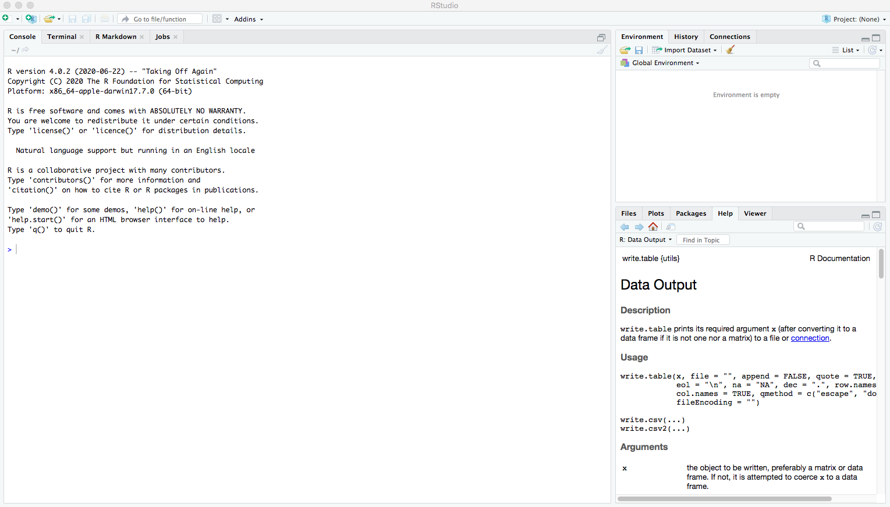
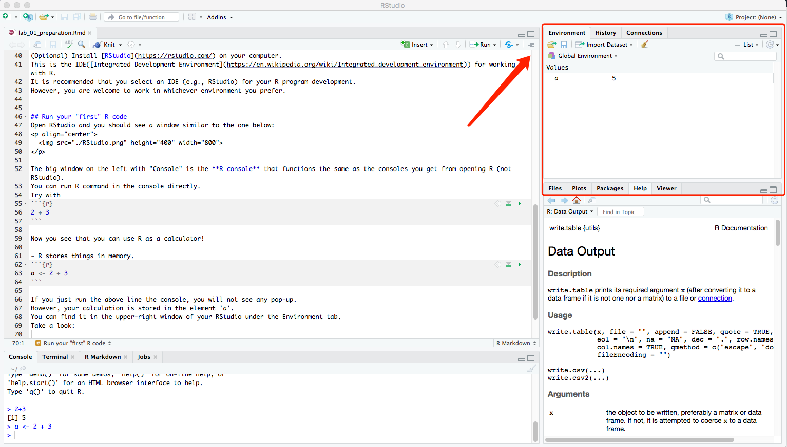
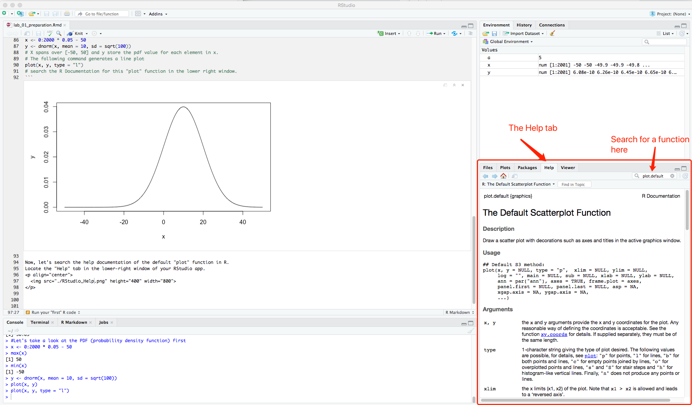

## Run your "first" R code
Open RStudio and you should see a window similar to the one below:
<p align="center">
  
</p>

The big window on the left with "Console" is the **R console** that functions the same as the consoles you get from opening R (not RStudio).
You can run R command in the console directly.
Try with
```{r}
2 + 3
```

Now you see that you can use R as a calculator!

- R stores things in memory.
```{r}
a <- 2 + 3
```

If you just run the above line the console, you will not see any pop-up.
However, your calculation is stored in the element 'a'.
You can find it in the upper-right window of your RStudio under the Environment tab.
Take a look:
<p align="center">
  
</p>

And, of course you can output the value of a by
```{r}
a
```

Let's plot some figures (the saying "a figure is worth a thousand words" should echo now).
We will draw $1000$ samples from a normal distribution with mean $10$ and variance $100$ (i.e., N(10, 100)).

```{r}
set.seed(7260)
#Let's take a look at the PDF (probability density function) first
x <- 0:2000 * 0.05 - 50
y <- dnorm(x, mean = 10, sd = sqrt(100))
# X spans over [-50, 50] and y store the pdf value for each element in x.
# The following command generates a line plot
plot(x, y, type = "l")
# search the R Documentation for this "plot" function in the lower right window.
```

Now, let's search the help documentation of the default "plot" function in R.
Locate the "Help" tab in the lower-right window of your RStudio app.
<p align="center">
  
</p>

```{r}
# Let's draw some random variables from the distribution
normal.samples <- rnorm(length(x), 10, 10)  # avoid using sample as the variable name because it's already used for a built-in function.  The bad behavior of R (python shares this overriding problem too)
# Produce a histogram of the random samples
hist(normal.samples)
```

The above histogram has the default "Frecuency" as the Y axis.  Let's change it to "Density"

```{r}
hist(normal.samples, probability = TRUE)
```

Now let's place the line plot over the histogram.

```{r}
hist(normal.samples, probability = TRUE)
lines(x, y, col="red", lwd=4)
#you may want to try the function "curve" too.  Go to its help page to find the usage.
```

-------------------------

Let's re-plot the above figures using the `ggplot2` package

```{r}
library(ggplot2)
library(tibble)
# first group data into a data frame (an upgraded one, i.e., tibble)
sampled.data <- tibble(x = x, y = y, normal.samples = normal.samples)

ggplot(data = sampled.data) +
  geom_line(mapping = aes(x = x, y = y)) +
  theme_bw()

ggplot(data = sampled.data) +
  geom_histogram(mapping = aes(x = normal.samples)) +
  theme_bw()

ggplot(data = sampled.data) +
  geom_histogram(mapping = aes(x = normal.samples, y = ..density..)) +
  theme_bw()

ggplot(data = sampled.data) +
  geom_histogram(mapping = aes(x = normal.samples, y = ..density..)) +
  geom_line(mapping = aes(x = x, y = y), col = "red", size = 2) +
  theme_bw()
```

This concludes our lab 1.  Please let me know if you run into any trouble.

-------------------------------------

## replicate figure of Davis's data

Davis's data on the measured and reported weight in kilograms of 101 women who were engaged in regular exercise.

```{r}
# read in data first
weights.data <- read.table("./Davis.txt")
weights.data[12, "height"] <- 166
weights.data[12, "weight"] <- 57
ggplot(data = weights.data, mapping = aes(x = reportedWeight, y = weight)) +
  geom_point(shape = 1) +
  geom_abline(slope = 1.0, intercept = 0.0, linetype = 2) + 
  geom_abline(slope = 0.97722, intercept = 1.7776) +
  coord_cartesian(xlim = c(38, 80), ylim = c(35, 80)) +
  theme_bw()
ggsave("figure_5_1.pdf", width = 8, height = 6)
```

How do we do linear regression and automatically add estimates of intercept and slope into the plot commands?

Do not worry too much about the code syntax right now, we will discuss them in the future.

```{r}
# read about the documentation of lm() function
slr.mod <- lm(weight ~ reportedWeight, data = weights.data)
summary(slr.mod)

ggplot(data = weights.data, mapping = aes(x = reportedWeight, y = weight)) +
  geom_point(shape = 1) +
  geom_abline(slope = 1.0, intercept = 0.0, linetype = 2) + 
  geom_abline(slope = slr.mod$coefficients[2], intercept = slr.mod$coefficients[1]) +
  coord_cartesian(xlim = c(38, 80), ylim = c(35, 80)) +
  labs(title = "Include linear regression line from lm() function estimates") +
  theme_bw()
```
